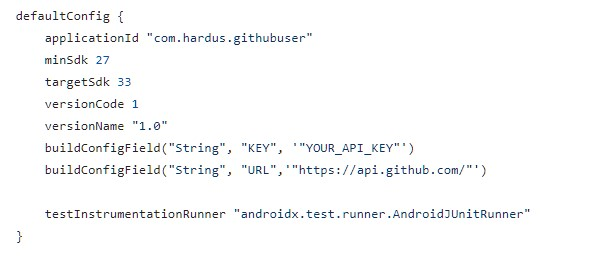

GithubUser App
=========================

  

GithubUser App adalah aplikasi android yang fungsi utamanya adalah memberikan informasi terkait pengguna github

## Technology Used
* RecyclerView
* Retrofit
* MVVM 
* API GitHub
* Room DB

## Demo

### How to use this app
Misalnya anda ingin mencoba aplikasi ini, silahkan clone dan ganti api yang ada di file build.gradle dengan api anda. 

